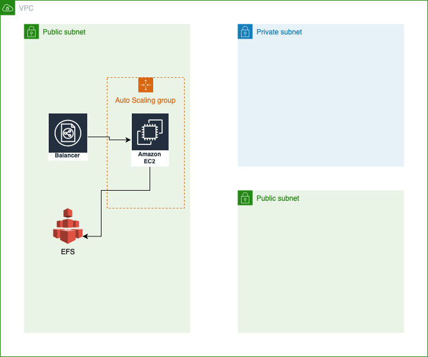

# aws_test
Creation infra with Terraform 

# Module Structure
This Module contains:
`main.tf` : Main file with all the resources declaration
`variables.tf` : Declaration of all the variables required by the module
`providers.tf` : Declaration of the providers required
`terraform.tfvars` : Value for the variables. This file is optional 

# Inputs
| Name | Description | Type | Default | Required |
|------|-------------|------|---------|:--------:|
cidr_vpc | Classless Inter-Domain Routing for VPC | string | "10.1.0.0/16" | NO
cidr_subnet | Classless Inter-Domain Routing for subnet | string | "10.1.0.0/24" | NO
shared_credentials_file | Access key location | n/a | string | YES
region | The region to host the servers | us-west-2 | string | NO
key_name | Name of the key | n/a | string | YES
instance_type | The instance type for the cluster | t2.micro | string | NO

## aws_test

This sample is used to create an example of EC2 servers with 2 entries for the minimum and 5 for the maximum and creates a MYSQL database on AWS RDS. EC2 instances run within Auto Scaling group created by [asg module](https://github.com/terraform-aws-modules/terraform-aws-autoscaling) and for the Load Balancer uses [elb](https://github.com/terraform-aws-modules/terraform-aws-elb)